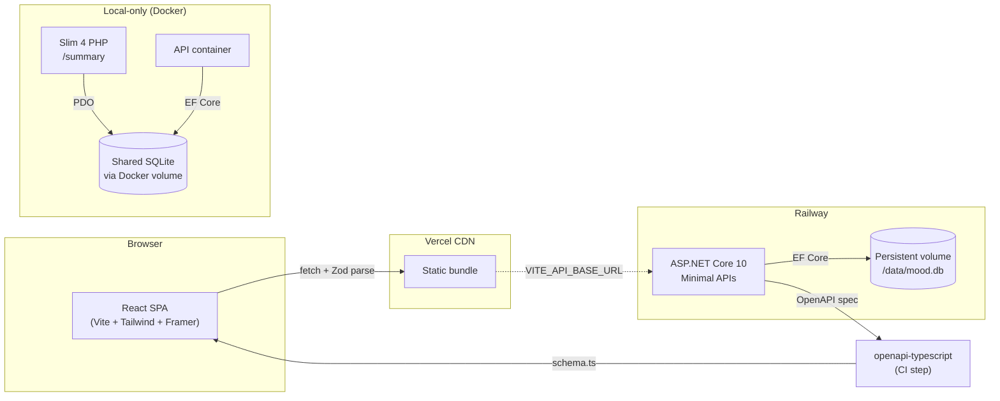
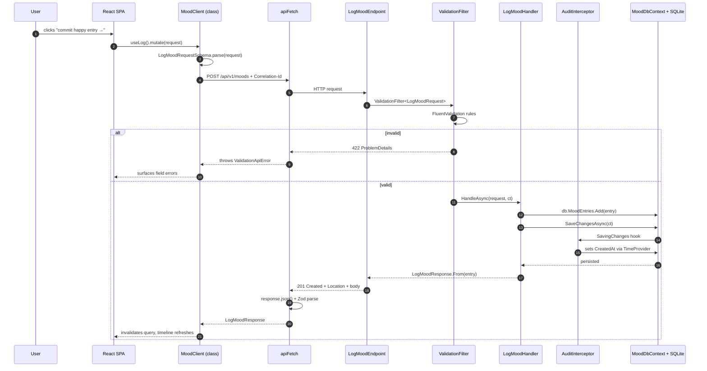
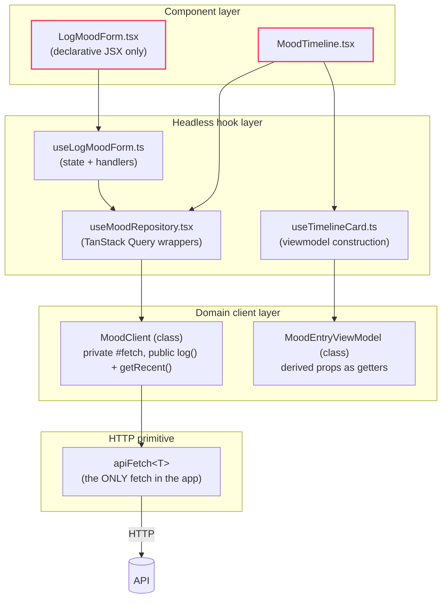
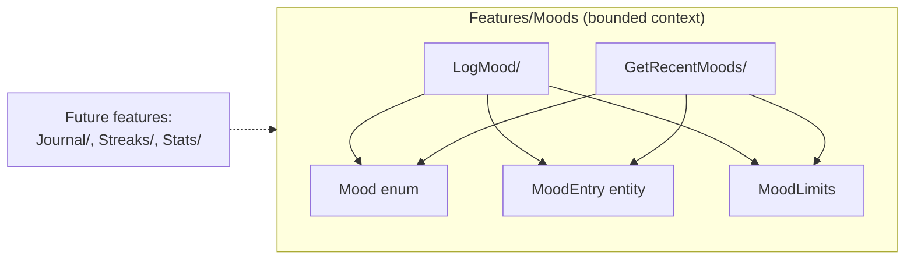

# Architecture

## System overview

## Request lifecycle (POST /api/v1/moods)

## Frontend data flow

> **Rule:** the component layer never imports `fetch`, `MoodClient`, or query keys. It only consumes hooks. Enforced by lint rule + code review.

## Bounded context

Architecture tests enforce that future features cannot reach into `Features/Moods/` internals — they get a `MoodEntryView` DTO via a public contract.

## See also

- [ADR-0001 — Vertical Slice over Clean Architecture](./adr/0001-vertical-slice-over-clean-architecture.md)
- [ADR-0002 — DbContext IS the Unit of Work](./adr/0002-no-unit-of-work-wrapper.md)
- [ADR-0003 — OpenAPI codegen for cross-stack types](./adr/0003-openapi-codegen-for-cross-stack-types.md)
